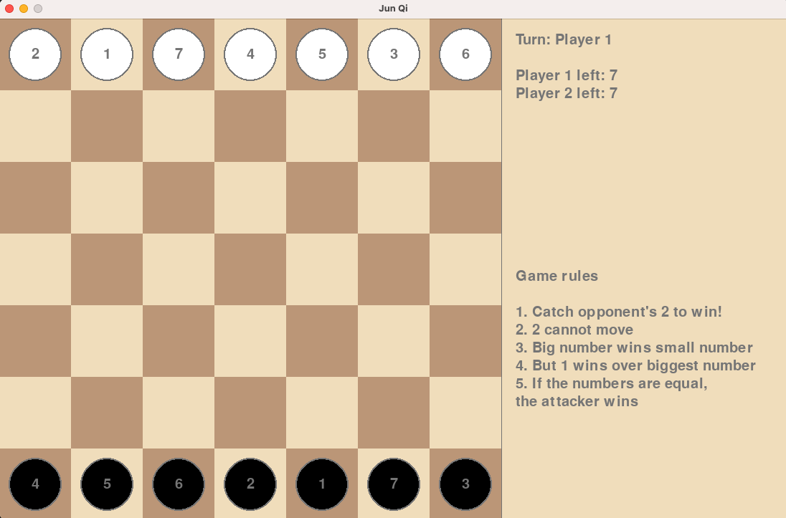

# Simple Jun Qi - board game

## Reference game

[Luzhanqi](https://en.wikipedia.org/wiki/Luzhanqi)

- 36 pieces
- Movement is divided into railroad and normal road, railroad can go straight if there is no blockage
- The higher ranked piece wins over small ranked piece. If both have same rank, both die.
- However, mines and bombers are killed regardless of the rank of the opponent.
- If you find a military flag, you win the game.
- The military flag can be placed one of two spots at the beginning.

## Rule Setting

### Our basic rules

- 9 pieces, 9 numbers
- Catch opponent's 2 to win
- 2 cannot move
- Big number wins small number
- But 1 wins over biggest number
- If the numbers are equal, the attacker wins

### Our variant rules

- Number of numbers: 9-12, number of objectives: 2-4
- Terrain, size, and shape of the map
- Number of players: 1 to 4

### Setting

- Fantasy: Human vs Human

### Platforms

- PC first, portrait mobile later
